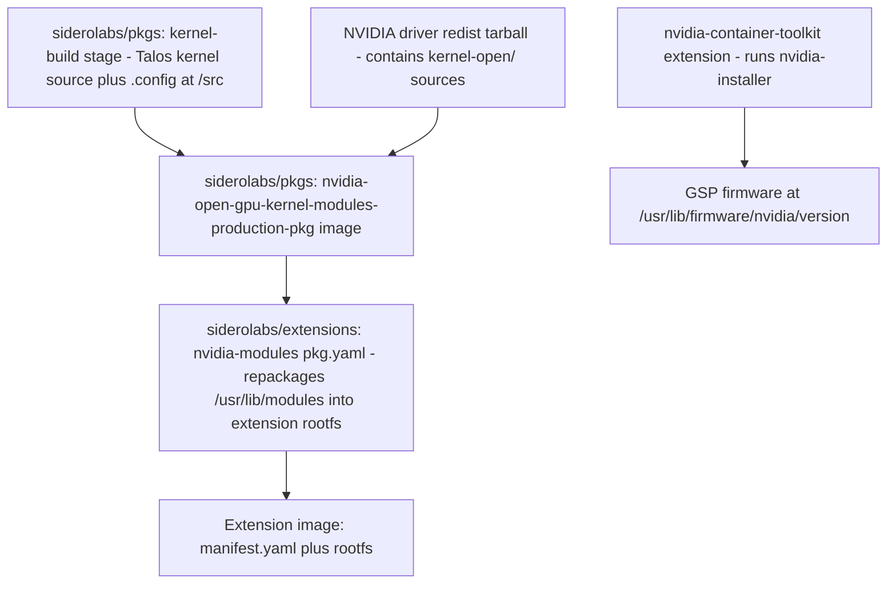
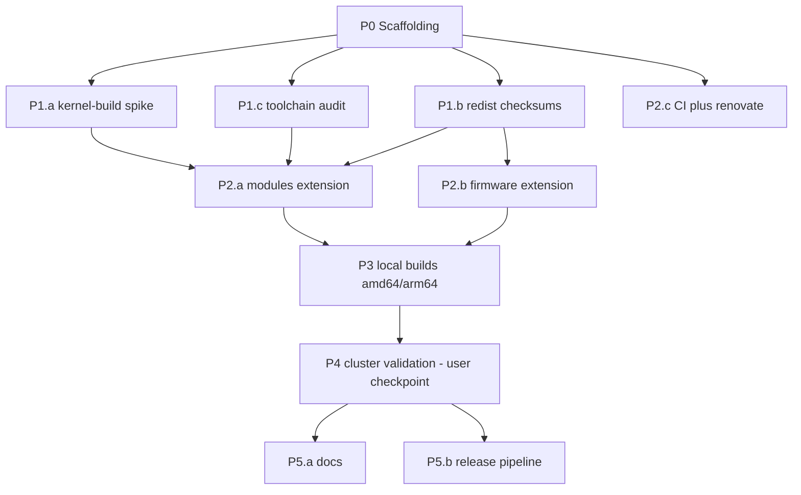

# Plan: Talos System Extension for the Latest NVIDIA Open GPU Kernel Modules

A standalone Talos Linux system extension that ships the **latest** NVIDIA open-source
GPU kernel modules ([NVIDIA/open-gpu-kernel-modules](https://github.com/NVIDIA/open-gpu-kernel-modules)),
tracking new driver releases faster than the upstream Sidero `nvidia-gpu` extensions,
which lag behind on the `production`/`lts` branches.

---

## 1. Background & Key Findings

### 1.1 How Sidero builds their NVIDIA extensions today

Research into [`siderolabs/extensions/nvidia-gpu`](https://github.com/siderolabs/extensions/tree/main/nvidia-gpu)
revealed a critical architectural fact: **the kernel modules are NOT compiled in the
`extensions` repo.** The build is split across two repos:



- **`siderolabs/pkgs`** compiles `nvidia.ko`, `nvidia-uvm.ko`, `nvidia-modeset.ko`,
  `nvidia-drm.ko`, `nvidia-peermem.ko` (plus `gdrdrv.ko` and `nvidia-fs.ko`) against the
  exact Talos kernel using clang/LLVM (`make LD=ld.lld OBJDUMP=llvm-objdump SYSSRC=/src`),
  publishing `ghcr.io/siderolabs/nvidia-open-gpu-kernel-modules-{production,lts}-pkg:<PKGS_TAG>`.
- **`siderolabs/extensions`** merely copies `/usr/lib/modules` from that pkg image into
  the extension rootfs, adds a modprobe blacklist, and attaches `manifest.yaml`.
- **GSP firmware** (`gsp_ga10x.bin`, `gsp_tu10x.bin`) — required by the open driver — is
  *not* shipped with the modules extension. It's installed by the companion
  `nvidia-container-toolkit` extension via `nvidia-installer --no-kernel-modules
  --override-file-type-destination=FIRMWARE:/rootfs/usr/lib/firmware/nvidia/<version>`.
- Versions are pinned in `nvidia-gpu/vars.yaml` with Renovate annotations
  (`# renovate: datasource=github-releases depName=nvidia/open-gpu-kernel-modules`),
  currently `NVIDIA_DRIVER_PRODUCTION_VERSION: 595.71.05` and
  `NVIDIA_DRIVER_LTS_VERSION: 580.167.08`.
- Extension version convention: `<driver-version>-<talos-tag>` (e.g. `595.71.05-v1.14.0`)
  because modules only work with the *exact* kernel they were built against.

### 1.2 Extension authoring conventions (from siderolabs/extensions + PR #1127)

PR #1127 turned out to be a **docs PR** ("document how to build a single extension and a
catalog") rather than an extension-addition PR, but it documents the local dev workflow
we will adopt:

```bash
# Build and push a single extension to a local registry
make <extension-name> PUSH=true REGISTRY=127.0.0.1:5005 USERNAME=<username>

# Build a scoped extensions catalog locally
make extensions PUSH=true REGISTRY=host.docker.internal:5005 USERNAME=<name> \
  TARGETS="<extension-name>" NONFREE_TARGETS= CRANE_FLAGS=--insecure
```

Canonical per-extension file set (bldr format, `# syntax = ghcr.io/siderolabs/bldr:v0.6.0`):

```
<name>/
├── pkg.yaml               # bldr build recipe (variant: scratch, steps, finalize)
├── manifest.yaml.tmpl     # extension manifest (v1alpha1: name/version/author/compatibility)
├── vars.yaml              # version pins + sha256/sha512 + renovate annotations
└── files/                 # static files (modprobe conf, udev rules)
```

Universal invariants:
- `variant: scratch`, `shell: /bin/bash`, dependency on `stage: base`
- `install` step populates `/rootfs/...`; `test` step runs `/extensions-validator validate`
- `finalize`: `/rootfs → /rootfs` and `/pkg/manifest.yaml → /`
- rootfs paths restricted to an allowlist: `/usr/lib/modules`, `/usr/lib/firmware`,
  `/usr/local`, `/etc/cri/conf.d`, plus NVIDIA carve-outs (`/usr/bin/nvidia-smi`, etc.)

### 1.3 NVIDIA open-gpu-kernel-modules release landscape (as of 2026-07-03)

| Branch | Latest GA release | Notes |
|---|---|---|
| **610 (new feature)** | `610.43.02` (2026-05-26) | Newest feature branch |
| **595 (production)** | `595.84` (2026-06-17) | Sidero pins `595.71.05` — behind |
| **580 (LTS)** | `580.173.02` (2026-06-25) | Sidero pins `580.167.08` — behind |
| 595.44.0x | prerelease | Vulkan dev beta — exclude |

**Our target: track the latest GA release** (a "latest" variant Sidero doesn't offer),
excluding prereleases (Vulkan beta drivers).

Other constraints of the open modules:
- **Turing or newer GPUs only** (GTX 16xx / RTX 20xx+, A-series, H-series, L-series, B-series).
- **GSP firmware is mandatory** and must exactly match the driver version at
  `/lib/firmware/nvidia/<version>/gsp_*.bin`.
- Userspace driver libraries (from the container toolkit / `nvidia-installer`) must also
  match the kernel module version exactly.
- Module sources ship inside NVIDIA's official redist archive
  (`https://developer.download.nvidia.com/compute/nvidia-driver/redist/nvidia_driver/linux-{x86_64,sbsa}/nvidia_driver-linux-<arch>-<ver>-archive.tar.xz`)
  under `kernel-open/` — this is what Sidero builds from (not the GitHub tarball), because
  the redist archive also carries the firmware and userspace bits.

---

## 2. Design Decision: Build Strategy

Two viable approaches; **we choose Option B**.

### Option A — Repackage Sidero's prebuilt `-pkg` images (rejected)
Simply repackage `ghcr.io/siderolabs/nvidia-open-gpu-kernel-modules-production-pkg`.
- ✅ Trivial, always kernel-compatible.
- ❌ **Defeats the purpose**: we'd be locked to Sidero's pinned driver versions
  (595.71.05 / 580.167.08), not the latest (610.43.02 / 595.84 / 580.173.02).

### Option B — Compile modules ourselves against the Talos kernel (chosen)
Replicate the `siderolabs/pkgs` build inside this repo: pull the Talos `kernel-build`
artifacts, download the latest NVIDIA redist archive, and build `kernel-open/` with
clang/LLVM.

- ✅ Full control over driver version — ship the latest GA within hours of release.
- ✅ Single-repo build; no dependency on Sidero's release cadence for driver bumps.
- ⚠️ We must pin `PKGS` to the exact pkgs tag of the target Talos release (from
  `talos/pkg/machinery/gendata/data/pkgs`) and rebuild per Talos release.
- ⚠️ New driver branches occasionally need patches for new kernels — mitigated by CI
  build matrix and a `patches/` directory.

Additionally, we ship a **companion firmware extension** (GSP firmware extracted from the
same redist archive into `/usr/lib/firmware/nvidia/<version>/`) so the modules actually
initialize without requiring Sidero's container-toolkit extension at a mismatched version.

---

## 3. Repository Layout (target state)

```
talos-nvidia-open-extension/
├── LICENSE
├── PLAN.md                                  # this document
├── README.md                                # usage, compatibility matrix, install docs
├── Pkgfile                                  # bldr frontend: syntax, format v1alpha2, global vars
├── Makefile                                 # build targets (modeled on siderolabs/extensions)
├── vars.yaml                                # shared: NVIDIA_DRIVER_LATEST_VERSION + checksums
│                                            #   (renovate-annotated, GA releases only)
├── nvidia-open-modules/                     # PRIMARY extension
│   ├── pkg.yaml                             # kernel module compile + install
│   ├── vars.yaml                            # VERSION: "{{ .NVIDIA_DRIVER_LATEST_VERSION }}-{{ .BUILD_ARG_TAG }}"
│   ├── manifest.yaml.tmpl
│   ├── files/
│   │   └── nvidia.conf                      # modprobe blacklist (Talos convention)
│   └── patches/                             # kernel-compat patches when needed
├── nvidia-open-firmware/                    # COMPANION extension: GSP firmware
│   ├── pkg.yaml                             # extract firmware from redist archive
│   ├── vars.yaml
│   └── manifest.yaml.tmpl
├── hack/
│   └── update-checksums.sh                  # bldr update wrapper
├── .github/
│   ├── workflows/
│   │   ├── ci.yaml                          # build matrix (amd64/arm64 × Talos releases), push on tag
│   │   └── release.yaml                     # tag → ghcr.io publish + cosign sign
│   └── renovate.json                        # regex manager for vars.yaml version pins
└── docs/
    └── machine-config-example.yaml          # Talos machine config snippet
```

---

## 4. Key File Specifications

### 4.1 Root `vars.yaml`

```yaml
# renovate: datasource=github-releases depName=nvidia/open-gpu-kernel-modules
NVIDIA_DRIVER_LATEST_VERSION: 610.43.02
NVIDIA_DRIVER_LATEST_AMD64_SHA256: <sha256 of nvidia_driver-linux-x86_64-610.43.02-archive.tar.xz>
NVIDIA_DRIVER_LATEST_AMD64_SHA512: <...>
NVIDIA_DRIVER_LATEST_ARM64_SHA256: <sha256 of nvidia_driver-linux-sbsa-610.43.02-archive.tar.xz>
NVIDIA_DRIVER_LATEST_ARM64_SHA512: <...>
```

> Note: verify `610.43.02` exists in NVIDIA's redist index for both arches before pinning;
> some GeForce-branch releases are x86_64-only. Fallback pin: `595.84`.

### 4.2 `nvidia-open-modules/pkg.yaml` (sketch)

```yaml
name: nvidia-open-modules
variant: scratch
shell: /bin/bash
dependencies:
  - stage: base
  # Talos kernel source + built artifacts at /src; PKGS must match the target Talos
  # release as defined in talos/pkg/machinery/gendata/data/pkgs
  - image: "{{ .BUILD_ARG_PKGS_PREFIX }}/kernel-build:{{ .BUILD_ARG_PKGS }}"
  - image: "{{ .LLVM_IMAGE }}:{{ .TOOLS_REV }}"     # clang/LLVM toolchain (as pkgs does)
steps:
  - env:
      ARCH: {{ if eq .ARCH "aarch64" }}arm64{{ else }}x86_64{{ end }}
      LLVM: "1"
    sources:
      # arch-conditional redist archive (contains kernel-open/ + firmware/)
      # {{ if eq .ARCH "aarch64" }}
      - url: https://developer.download.nvidia.com/compute/nvidia-driver/redist/nvidia_driver/linux-sbsa/nvidia_driver-linux-sbsa-{{ .NVIDIA_DRIVER_LATEST_VERSION }}-archive.tar.xz
        sha256: "{{ .NVIDIA_DRIVER_LATEST_ARM64_SHA256 }}"
      # {{ else }}
      - url: https://developer.download.nvidia.com/compute/nvidia-driver/redist/nvidia_driver/linux-x86_64/nvidia_driver-linux-x86_64-{{ .NVIDIA_DRIVER_LATEST_VERSION }}-archive.tar.xz
        sha256: "{{ .NVIDIA_DRIVER_LATEST_AMD64_SHA256 }}"
      # {{ end }}
    prepare:
      - tar -x --strip-components=1 -f nvidia_driver-*.tar.xz -C /nvidia-driver
    build:
      # LLVM binutils forced for ThinLTO compat (NVIDIA/open-gpu-kernel-modules#214)
      - |
        cd /nvidia-driver/kernel-open
        make LD=ld.lld OBJDUMP=llvm-objdump -j $(nproc) SYSSRC=/src modules
    install:
      - |
        KVER=$(cat /src/include/config/kernel.release)
        mkdir -p /rootfs/usr/lib/modules/${KVER} /rootfs/usr/local/lib/modprobe.d
        cp /src/modules.{order,builtin,builtin.modinfo} /rootfs/usr/lib/modules/${KVER}/
        cd /nvidia-driver/kernel-open
        make LD=ld.lld OBJDUMP=llvm-objdump SYSSRC=/src \
          INSTALL_MOD_PATH=/rootfs/usr INSTALL_MOD_STRIP=1 modules_install
        cp /pkg/files/nvidia.conf /rootfs/usr/local/lib/modprobe.d/nvidia.conf
    test:
      - |
        mkdir -p /extensions-validator-rootfs
        cp -r /rootfs/ /extensions-validator-rootfs/rootfs
        cp /pkg/manifest.yaml /extensions-validator-rootfs/manifest.yaml
        /extensions-validator validate --rootfs=/extensions-validator-rootfs --pkg-name="${PKG_NAME}"
finalize:
  - from: /rootfs
    to: /rootfs
  - from: /pkg/manifest.yaml
    to: /
```

Notes:
- `modules_install` invokes `depmod` implicitly; the copied `modules.order`/`modules.builtin`
  files let depmod resolve builtin symbols (matches current pkgs behavior — no explicit
  `depmod` or `zz-swap-in-kernel` step exists anymore upstream).
- Modules produced: `nvidia.ko`, `nvidia-uvm.ko`, `nvidia-modeset.ko`, `nvidia-drm.ko`,
  `nvidia-peermem.ko`.
- **Open question for Phase 1**: whether `kernel-build:<PKGS>` is published to
  `ghcr.io/siderolabs` (pkgs consumes it as `stage: kernel-build` in-repo). If it isn't
  pullable, fallback: vendor a thin pkgs-style overlay that rebuilds the kernel-prepare
  stage from `siderolabs/pkgs` at the pinned tag (git submodule or `bldr` multi-context),
  or build via `docker buildx --file Pkgfile --target kernel-build` against a checkout of
  pkgs. Phase 1 resolves this definitively.

### 4.3 `nvidia-open-modules/manifest.yaml.tmpl`

```yaml
version: v1alpha1
metadata:
  name: nvidia-open-modules
  version: "{{ .VERSION }}"
  author: <you>
  description: |
    [{{ .TIER }}] Latest NVIDIA open GPU kernel modules built against a specific Talos kernel.
  compatibility:
    talos:
      version: ">= v1.10.0"
```

`vars.yaml`: `VERSION: "{{ .NVIDIA_DRIVER_LATEST_VERSION }}-{{ .BUILD_ARG_TAG }}"`,
`TIER: "community"`.

### 4.4 `nvidia-open-modules/files/nvidia.conf`

```
blacklist nvidia
blacklist nvidia_uvm
blacklist nvidia_drm
blacklist nvidia_modeset
```

(Talos convention: users load modules explicitly via `machine.kernel.modules`.)

### 4.5 `nvidia-open-firmware/pkg.yaml` (sketch)

Extract `firmware/gsp_ga10x.bin` and `firmware/gsp_tu10x.bin` from the same redist
archive into `/rootfs/usr/lib/firmware/nvidia/{{ .NVIDIA_DRIVER_LATEST_VERSION }}/`.
No compilation; same sources/checksums; same validator test step. Users who instead run
Sidero's `nvidia-container-toolkit` at a matching version can skip this extension —
document both paths in README, including the license note (GSP firmware is redistributed
under NVIDIA's license, not MIT/GPL — consider a `nonfree` marker like upstream).

---

## 5. Execution Plan — Phases with Parallel Agent Assignments

Work is decomposed into agent-delegable tasks with **disjoint write scopes**, maximizing
parallelism. `⇉` marks tasks that run concurrently.

### Phase 0 — Scaffolding (single agent, fast)
- `P0.1` Create repo skeleton: `Pkgfile`, `Makefile`, root `vars.yaml`, directory tree.
  Copy Makefile patterns from siderolabs/extensions (bldr eval for tag computation,
  `PLATFORM`, `PUSH`, `REGISTRY`, `PKGS`, `PKGS_PREFIX`, `TAG` vars).

### Phase 1 — Feasibility spikes (3 agents in parallel ⇉)
- `P1.a` **Kernel-build availability spike**: verify whether
  `ghcr.io/siderolabs/kernel-build:<PKGS>` (and `LLVM_IMAGE`/`TOOLS_REV` values) are
  pullable; extract exact `PKGS` tags for the last two Talos releases from
  `talos/pkg/machinery/gendata/data/pkgs`. Deliverable: confirmed dependency lines for
  `pkg.yaml`, or the fallback strategy (pkgs checkout build).
- `P1.b` **Redist archive verification**: confirm `610.43.02` (else `595.84`) exists for
  linux-x86_64 and linux-sbsa in NVIDIA's redist index; compute sha256/sha512 for both;
  confirm `kernel-open/` and `firmware/gsp_*.bin` layout inside the archive.
  Deliverable: filled-in root `vars.yaml`.
- `P1.c` **Toolchain/flag audit**: read `siderolabs/pkgs/nvidia-open-gpu-kernel-modules/production/pkg.yaml`
  at the pinned pkgs tag and record every env var, make flag, and workaround
  (LLVM=1, ld.lld/llvm-objdump, module-signature strip check). Deliverable: verified
  build/install step scripts for §4.2.

### Phase 2 — Implementation (3 agents in parallel ⇉, disjoint paths)
- `P2.a` **`nvidia-open-modules/`**: pkg.yaml, vars.yaml, manifest.yaml.tmpl,
  files/nvidia.conf per §4.2–4.4, using Phase 1 outputs.
- `P2.b` **`nvidia-open-firmware/`**: pkg.yaml, vars.yaml, manifest.yaml.tmpl per §4.5.
- `P2.c` **CI + automation**: `.github/workflows/ci.yaml` (buildx multi-platform matrix,
  amd64 + arm64, per-Talos-release `PKGS` matrix), `renovate.json` regex manager
  (`extractVersion` filtering GA tags only — exclude `.44.` Vulkan-beta prereleases),
  `hack/update-checksums.sh`.

### Phase 3 — Local build validation (sequential; parallel across arches where possible)
- `P3.1` `make nvidia-open-modules PLATFORM=linux/amd64` against latest Talos `PKGS`.
- `P3.2` ⇉ arm64 build once amd64 passes.
- `P3.3` Inspect output: `make local-nvidia-open-modules DEST=_out` — verify
  `/rootfs/usr/lib/modules/<kver>/kernel/.../nvidia*.ko`, depmod metadata, manifest.
- `P3.4` Delegate log-heavy build/test runs to sub-agents that return only failing lines
  and diagnostics summaries.

### Phase 4 — Cluster validation (requires user hardware — checkpoint with user)
- `P4.1` Push to local/private registry; bake image via Image Factory boot assets or
  `installer` with `--system-extension-image`, or apply as extension image in machine
  config for a Turing+ GPU node.
- `P4.2` Machine config: load modules (`nvidia`, `nvidia_uvm`, `nvidia_drm`,
  `nvidia_modeset`) via `machine.kernel.modules`; pair with the firmware extension (or
  matching container-toolkit); sysctl `net.core.bpf_jit_harden` etc. per Talos NVIDIA docs.
- `P4.3` Verify: `talosctl read /proc/driver/nvidia/version`, dmesg for GSP firmware load,
  `nvidia-smi` via toolkit, optional CUDA smoke test pod.

### Phase 5 — Docs & release (2 agents in parallel ⇉)

> See also Phase 6 (userspace extension), added after the pivot to GitHub-source builds.
- `P5.a` **README.md**: compatibility matrix (driver × Talos release), install
  instructions (Image Factory schematic + manual), firmware/toolkit version-matching
  caveats, Turing+ GPU requirement, license notes.
- `P5.b` **release.yaml**: tag-driven publish to ghcr.io with tags
  `<driver>-<talos-tag>` (e.g. `610.43.02-v1.14.0`), cosign signing, GitHub release notes.



---

## 6. Risks & Mitigations

| Risk | Impact | Mitigation |
|---|---|---|
| `kernel-build` image not published/pullable | Blocks Option B build | P1.a spike first; fallback to building kernel-build from a pinned `siderolabs/pkgs` checkout |
| New driver branch fails against new Talos kernel | Build breakage on bumps | `patches/` dir; CI matrix catches early; hold at last-good GA |
| Redist archive missing for arm64 (sbsa) on some releases | arm64 gap | Pin per-arch versions independently if needed; document |
| GSP firmware version mismatch with modules | Driver fails to init at runtime | Single shared `NVIDIA_DRIVER_LATEST_VERSION` var drives both extensions; CI asserts equality |
| Userspace (container toolkit) mismatch | `nvidia-smi`/CUDA failures | README documents pairing requirements; recommend CDI + matching toolkit |
| Renovate picks Vulkan-beta prereleases | Ships beta drivers | `extractVersion` regex excludes prerelease tags; `ignoreUnstable: true` |
| Kernel module signing (Talos enforces signature check) | Modules rejected at load | Replicate pkgs' strip-preserves-signature test; investigate whether out-of-tree unsigned modules load on the target Talos config (secure boot vs. not) — validate in P4 |
| Talos version drift (extension only valid for one kernel) | Boot with wrong pairing | Compound version tag `<driver>-<talos-tag>`; manifest `compatibility` pin; rebuild per Talos patch release in CI |

---

## 7. Immediate Next Steps

1. Approve this plan (or adjust: driver branch to track, extension naming, author string
   for manifests, whether to include the firmware companion).
2. Kick off **Phase 0** scaffolding, then spawn the three **Phase 1** spike agents in
   parallel.
3. Checkpoint after Phase 1 to lock the dependency strategy before implementation.

---

### Phase 6 — Userspace / container-toolkit extension (follow-up, required for real GPU workloads)

Because this repo tracks driver versions **ahead of** Sidero's pins, their
`nvidia-container-toolkit` extension (driver libs at 595.71.05) will generally not match
our modules. Kubernetes GPU workloads need matching userspace on the host: `libcuda`,
`libnvidia-ml`, `nvidia-smi`, the container-toolkit binaries, persistenced, and CDI
generation. Follow-up scope:

- `P6.a` New `nvidia-open-userspace` (or combined toolkit) extension: run the `.run`
  installer's `nvidia-installer --no-kernel-modules` inside a builder container (Sidero
  does this in a wolfi-base stage with `depmod`/`modprobe` stubbed to /bin/true),
  redirecting file-type destinations into the extension rootfs allowlist paths
  (`/usr/local/glibc`-style lib dir, `/usr/bin/nvidia-smi` carve-outs, `/etc/vulkan`).
  Reuse the same `.run` source + checksums from `vars.yaml`, guaranteeing version lock
  with modules + firmware.
- `P6.b` Port Sidero's `nvidia-container-toolkit` build (toolkit binaries, persistenced
  wrapper service, `nvidia-persistenced.yaml` / `nvidia-cdi-gen.yaml` service specs,
  udev rules) against our driver version.
- `P6.c` CI: assert modules/firmware/userspace all resolve the same
  `NVIDIA_DRIVER_VERSION`; add a CUDA smoke-test pod manifest to docs.
- Until Phase 6 lands, the extension pair is usable for validation (`/proc/driver/nvidia/version`,
  dmesg GSP load) but not for end-to-end CUDA workloads.

---

## 8. Status Log

### 2026-07-03 — Phases 0–3 executed

**Phase 1 spike outcomes (locked decisions):**
- `kernel-build` is **not published** to ghcr.io (never pushed; only an in-graph stage in
  siderolabs/pkgs). No public image carries the Talos kernel source at `/src`.
  → **Strategy locked: overlay build.** `make nvidia-open-latest-pkg` clones
  siderolabs/pkgs at the pinned commit (checkout lives outside the repo at
  `~/.cache/talos-nvidia-open-extension/pkgs`, because bldr scans the whole build context
  for pkg.yaml files and ignores .dockerignore), copies `overlay/nvidia-open-latest/` +
  root `vars.yaml` in, and builds inside the pkgs BuildKit graph.
- **610.43.02 and 595.84 do not exist in NVIDIA's redist channel** (GitHub releases run
  ahead of redist). Newest redist GA for both arches: **595.71.05** (production) /
  580.173.02 (LTS). Pinned 595.71.05 with NVIDIA-published sha256s.
- Verified pins: Talos **v1.13.5** → PKGS `v1.13.0-36-g6b315f7` → kernel **6.18.36**,
  TOOLS `v1.13.0-6-g9b78252`. Exact upstream build recipe captured and transcribed
  (LLVM=1, ld.lld/llvm-objdump, INSTALL_MOD_STRIP=1, implicit depmod, signature test).
- v1 scope: NVIDIA open modules only (gdrcopy/nvidia-fs deferred).

**Phase 2 delivered:** `overlay/nvidia-open-latest/`, `nvidia-open-modules/`,
`nvidia-open-firmware/`, `internal/base/`, `.github/workflows/ci.yaml`,
`.github/renovate.json` (custom redist-backed datasource), `docs/`, `README.md`,
`Makefile`, `Pkgfile`, `hack/update-checksums.sh`.

**Phase 3 validation:**
- ✅ `make overlay-sync` — pinned checkout + overlay verified (`git describe` matches PKGS).
- ✅ pkgs graph resolves with our overlay target; NVIDIA archive + toolchain images resolve.
- ✅ `nvidia-open-firmware` built end-to-end: checksum OK, `gsp_ga10x.bin`/`gsp_tu10x.bin`
  installed to `/usr/lib/firmware/nvidia/595.71.05/`, extensions-validator passed,
  manifest renders as `595.71.05-v1.13.5`.
- ⛔ `nvidia-open-latest-pkg` blocked by a **transient kernel.org CDN outage** (all
  tarball URLs 404 as of this run, including ancient releases; same URLs upstream pkgs
  CI uses). Retry `make nvidia-open-latest-pkg` when kernel.org recovers, then
  `make nvidia-open-modules` and Phase 4 cluster validation.

### 2026-07-03 — Pivot to GitHub source tarball + .run firmware (user decision: track latest)

Redist channel permanently lags GitHub GA releases (595.71.05 vs 610.43.02), so sources
were switched:

- **Modules**: built from the GitHub release tarball (arch-independent, ~26 MB;
  compiles the full resource manager from `src/` via the repo's top-level
  `make modules SYSSRC=/src`, instead of linking redist's precompiled
  `nv-kernel.o_binary`). Pin: **610.43.02** (latest GA feature branch).
- **GSP firmware**: extracted from the official `.run` installer
  (`sh nvidia.run --extract-only`; verified to contain `gsp_ga10x.bin`,
  `gsp_tu10x.bin`, plus new `ucodes_*.bin` at 610.x — all shipped).
- All six checksums computed and pinned in `vars.yaml` (NVIDIA publishes none for
  these artifacts). `hack/update-checksums.sh` rewritten accordingly.
- Renovate simplified to plain `github-releases` (auto-skips 595.44.x Vulkan-beta
  prereleases).
- **Known risks for the first module build** (validate when kernel.org recovers):
  GitHub archive digests are not contractually stable (rare; re-pin if it ever shifts),
  and the `src/` resource-manager compile may need a `CC` tweak in the pkgs LLVM
  toolchain environment (kernel side is clang via `LLVM=1`; `src/` uses the repo's
  `utils.mk` default compiler).
- **Phase 6 added**: userspace/container-toolkit extension from the same `.run`,
  required because Sidero's toolkit extension won't version-match our modules.

### 2026-07-03 — kernel source fallback: cgit snapshots (revised diagnosis: local block)

Initially attributed to a kernel.org outage; revised after the user flagged local
blocking. Evidence points to **path-based filtering on this network's egress**, not a
global outage: DNS resolves to genuine Fastly with a valid GlobalSign cert for
cdn.kernel.org (no TLS MITM), yet decade-old tarballs "404" across cdn.kernel.org and
independent mirrors (MIT, Rackspace), MIT serves parent directory listings but returns
0 bytes for `v6.x/`, and www.kernel.org / git.kernel.org work fine. Workaround shipped:

- `hack/patch-kernel-source.sh` + `KERNEL_SRC_FALLBACK=1` (Makefile, default on):
  `overlay-sync` patches the pkgs checkout to download the kernel from
  **git.kernel.org's cgit snapshot service** (separate infrastructure, generated from
  the stable tree's `v6.18.36` tag) instead of cdn.kernel.org. Snapshot is .tar.gz with
  its own checksums (pinned in the Makefile; verified: identical `linux-6.18.36/` source
  layout); extract command patched to auto-detect compression.
- ✅ Validated live: `kernel-prepare:cksum-verify` passed and `kernel-build` entered the
  actual kernel compile. Downloads/verifications are now in the BuildKit cache.
- Defaults: `KERNEL_SRC_FALLBACK=1` locally (works regardless of the block); **CI passes
  `KERNEL_SRC_FALLBACK=0`** since GitHub runners reach cdn.kernel.org normally and the
  canonical tarball keeps Sidero's original pinned checksums (smaller supply-chain
  deviation). Re-pin `KERNEL_SRC_*` checksums when bumping `PKGS`.
- ⚠ Local caveat: `PLATFORM=linux/amd64` on an Apple Silicon Mac compiles the kernel
  under emulation (hours). Prefer the GitHub Actions `pkg` job (native amd64/arm64
  runners) for the full build.
